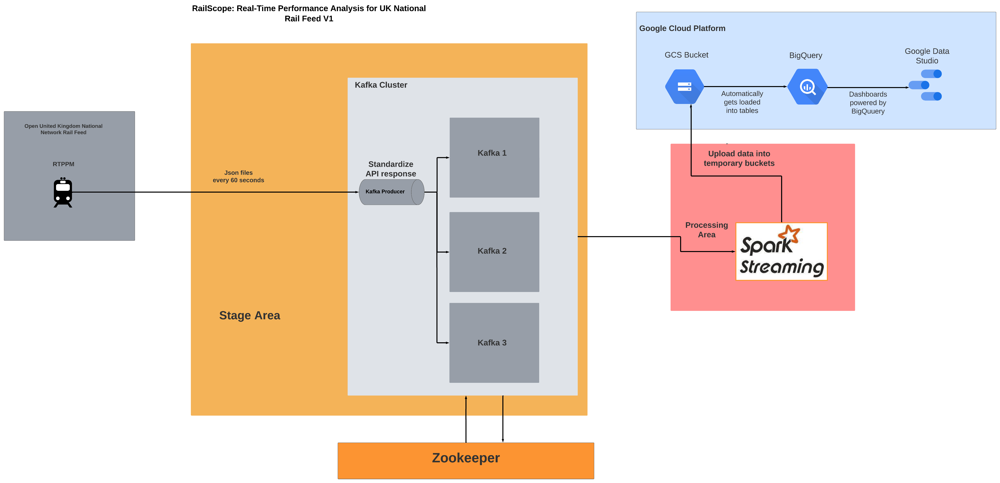

# 🚂 RailScope

🚦 Real-Time Performance Analysis for UK National Rail 🛤️

## 📝 Project description:

The RTPPM API provides real-time data on the Public Performance Measure (PPM), including metrics such as on-time trains, late trains, canceled/very late trains, and an indicator of overall performance. 

The data from this API will be transformed and processed for non-technical users.

The RTPPM API data is expected to arrive every 60 seconds

The dashboard will display key performance indicators such as on-time percentage, cancellations, and delays.

The dashboard will be designed for use by both operations managers and other stakeholders who need to monitor the performance of the National Rail system, as well as the general public.

 By making the dashboard publicly available, anyone can monitor the performance of the National Rail system without having to study the technical aspects of the underlying APIs.

## 🚆 Project Analysis

## [🔍 Explore the Analysis](./analysis/README.md)


Welcome to the project analysis section! Here, you can find all the in-depth analyses I have conducted on the UK Network Rail Feed dataset to evaluate the performance of the railway system. These analyses cover various aspects such as Public Performance Measure (PPM), trends, and performance distributions, providing valuable insights for stakeholders to make informed decisions on service improvements.


## 📚 Project Glossary
Discover the definitions and explanations of terminology used throughout the project. This glossary provides clarity on key terms, making it easier to understand the context and purpose of the analyses.

[🔎 Explore the Glossary](./glossary/README.md)

## 🛠️ Pre requisites:

### 📡 Network Rail Account

First, register for an account by visiting https://publicdatafeeds.networkrail.co.uk/. 
You will receive a confirmation email 📧. Follow the instructions to log in and change your password. When your account is active, you can connect to the service. Your account may be in one of three states - the system will send you an email when your account is activated and able to access feeds.


## ☁️ Cloud 
In this section we will leaverage all the processing to GCP servers bla bla ba

## 💻 Local
If you want to run this project "locally" you can go to this section, please take in mind that you will need to use some cloud services from gcp like GCS for data lake storage, BigQuery for Data warehousing and Google Data Studio to create the dashboards

## Steps to run this project

### 1. Kafka server
1. Open a new terminal
2. Navigate into the following directory = RailScope/national_rail_project/local/src/dev/docker/
3. Run docker compose up
4. Wait until all services get in a healthy status

Once all container are up an running

### 2. Spark application
1. Make sure you have spark installed in your local, if not go to [installation guide](local/README.md)
2. [Submit the spark application](https://spark.apache.org/docs/3.4.0/submitting-applications.html#content)
3.
4. 


### 3. API connnection and message producer
1. Make sure you have a working Network Rail Account, if not go back to the pre-requesite section.
2. Move into the following directory = RailScope/national_rail_project/local/src/dev
3. Run the following command
```bash
python message_producer --stomp_username YOUR_EMAIL --stomp_password YOUR_PASSWORD
```
4. If you experience disconections while using this script you can use the following flags to modify the hearbeat interval and reconnection based on your timeout differences.
```bash
--stomp_heartbeat_interval_ms 
--stomp_reconnect_delay_sec
```


### Project architecture overview



The architecture of this project involves several steps to collect, process, and analyze data from UK NationalRail Feed:

1. Using the [StompClient](./local/src/dev/message_producer.py) class, we connect to the UK NationalRail Feed to receive messages every 60 seconds in a JSON format. The class handles the connection, subscription, error handling, and reconnection in case of failure.

2. Before sending the messages to their respective topics, we apply eight [JSON parser functions](./local/src/dev/utils/json_parser.py) to break down the 3,000 lines of nested JSON schema into five dictionaries and three lists of dictionaries. These functions run in a [pool of two workers](./local/src/dev/utils/topic_hub.py) for optimal performance. 

3. Once the desired information is extracted from the API response, the output from the functions is sent to their respective topics.

4. Spark Streaming ingests the data and performs schema enforcement for all incoming messages from the Kafka brokers.

6. After validating the schema, we cast the messages into their proper types.

7. Streaming DataFrames are processed to create aggregations that provide business value to the data.


9. All Streaming DataFrames are loaded into temporal GCS buckets.

10. Data it's automatically loaded from the GCS Bucket into their respective table in BigQuery.

11. The Google Data Studio dashboard is powered by the BigQuery dataset.

This project architecture overview outlines the high-level steps involved in collecting and processing data from UK NationalRail Feed. Each step is designed to ensure the efficient and accurate processing of the data, from extraction to analysis.