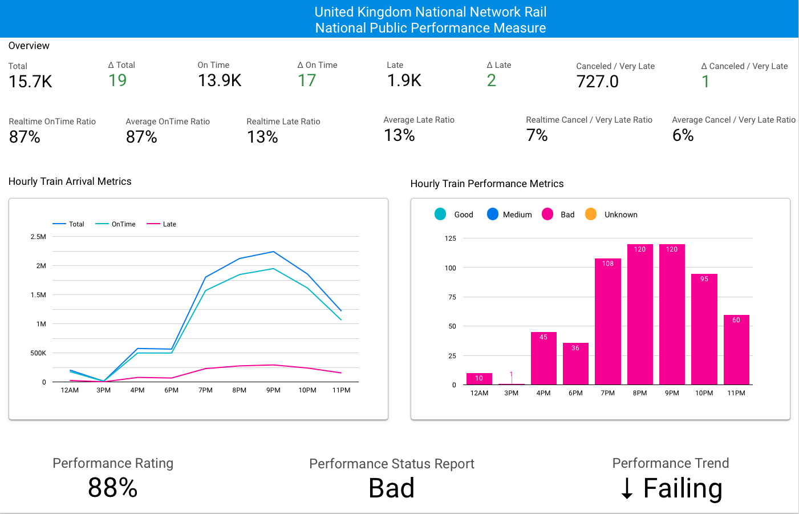

# UK Network Rail Feed - Analysis 

## Real Time Public Performance Measure (RTPPM)

## National Public Performance Measure


### Description
The analysis leverages data ingested from the UK Network Rail Feed to calculate various performance metrics and ratios, identify trends, and understand the distribution of performance indicators. 


### Message schema
```json
{
    "Total": "15056",
    "OnTime": "13375",
    "Late": "1681",
    "CancelVeryLate": "578",
    "PPM_text": "88",
    "PPM_rag": "R",
    "PPM_ragDisplayFlag": "Y",
    "RollingPPM_text": "87",
    "RollingPPM_rag": "R",
    "RollingPPM_trendInd": "-",
    "timestamp": "1678141260000"
}
```

## Analysis
### 1. Performance ratios

Compute performance ratios like on-time ratio, late ratio, 
and cancellation ratio to better understand the overall performance.

```python
 df_with_ratios = (
        df.withColumn("on_time_ratio", round((col("OnTime") / col("Total")) * 100, 2))
        .withColumn("late_ratio", round((col("Late") / col("Total")) * 100, 2))
        .withColumn(
            "cancel_very_late_ratio",
            round((col("CancelVeryLate") / col("Total")) * 100, 2),
        )
        .select(
            "Total",
            "OnTime",
            "Late",
            "CancelVeryLate",
            "on_time_ratio",
            "late_ratio",
            "cancel_very_late_ratio",
            "timestamp",
        )
    )
```