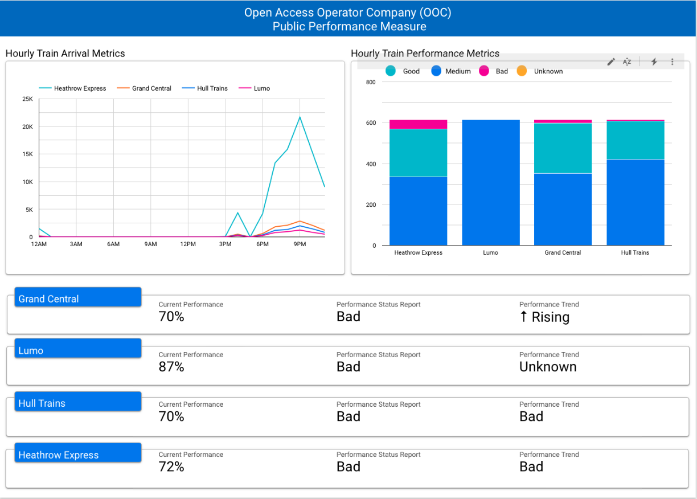

# UK Network Rail Feed - Analysis 

## Real Time Public Performance Measure (RTPPM)

## OOC Public Performance Measure



## Description
The analysis focuses on data ingested from the UK Network Rail Feed to evaluate the performance of Open Access Operators Companies (OOC) within the UK national railway system. By examining various performance metrics, such as the Public Performance Measure (PPM), Rolling PPM, and corresponding performance indicators (RAG status and trend), the analysis aims to provide insights into the operational efficiency of these non-franchised train operators. These insights can help stakeholders identify areas that require improvement, monitor the impact of interventions, and facilitate informed decision-making to enhance the performance of Open Access Operators across the rail network.


## Message schema
```json
{
    "Total": "125",
    "PPM_text": "29",
    "PPM_rag": "R",
    "RollingPPM_text": "38",
    "RollingPPM_rag": "R",
    "RollingPPM_trendInd": "+",
    "operatorCode": "86",
    "name": "Heathrow Express",
    "timestamp": "1678141260000"
}
```

## Analysis

### 1. Analyze PPM_rag, RollingPPM_rag, and RollingPPM_trendInd by operator
Calculate the distribution of performance indicators for each OOC operator to gain insights into their performance patterns.

```python
df_with_count = df.groupBy(
        col("name"),
        col("PPM_rag"),
        col("RollingPPM_rag"),
        col("RollingPPM_trendInd"),
    ).agg(count("*").alias("count_per_operator"))
```
